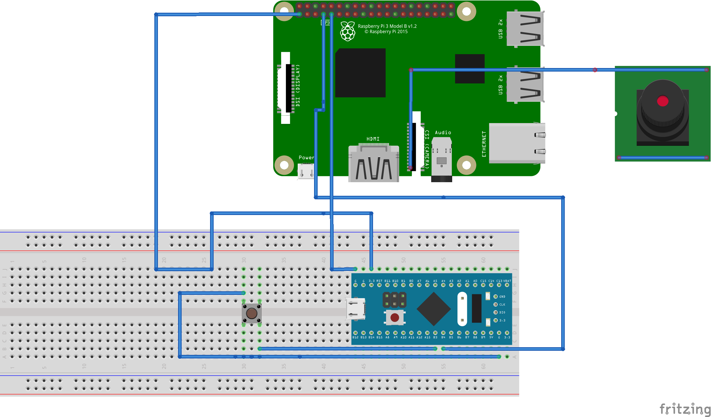
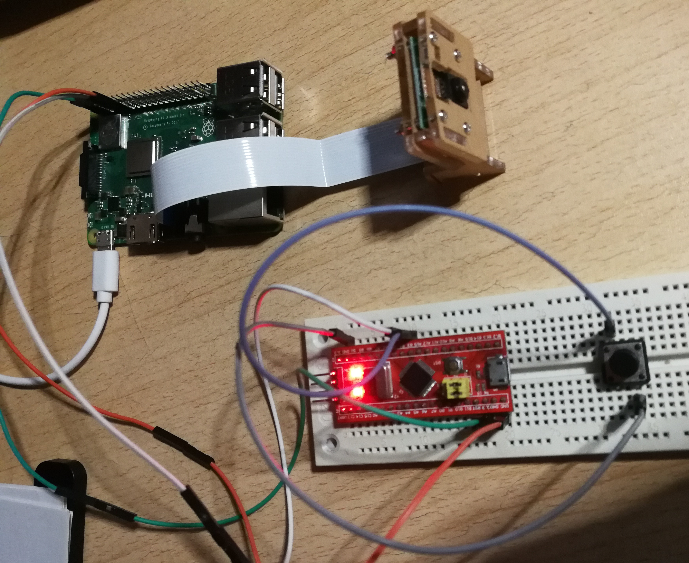
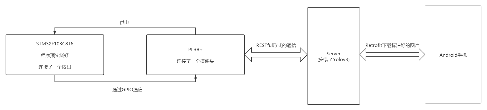
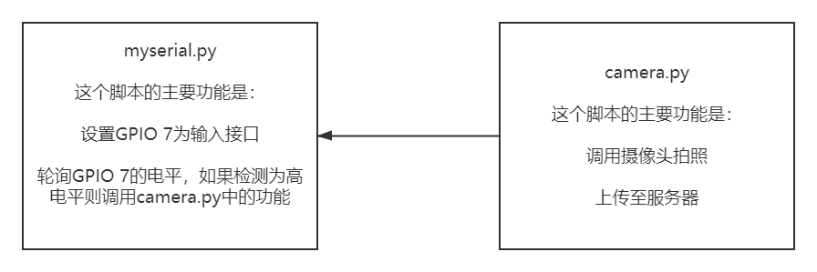
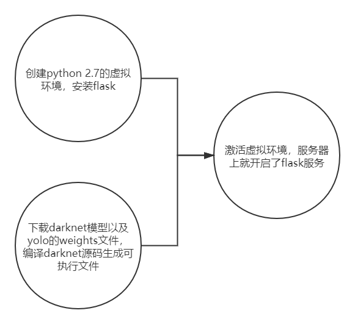

# 嵌入式课程设计：远程照相机

## 项目简介

### 灵感来源

- 本实验的灵感来源于一个远程打印机，某宝上的对这个大打印机的功能如下图，基本的功能是一个人持手机，另一个人有这个远程打印机，且打印机联网，持有手机的人可以上传图片并命令远程的打印机打印自己上传的图片
  - 

### 本工程的场景

- 受到上面产品的启发，我们开发了一个远程的相机，主要的功能是：
  - 一个人在一端按下STM32F103开发板上的按钮，树莓派的摄像头会拍照并上传到服务器上
  - 另一端的一个人可以通过手机上的APP拉取服务器上的图片，查看另一端排到的照片

## 工程所用设备

### 硬件

- 按钮一个
- STM32F103C8T6开发板一块
- 面板报以及杜邦线若干
- 树莓派摄像头一个(自行购买)

- 路由器供树莓派连接

### 软件

- CubeIDE：用于STM32F103开发板的开发
- vscode：用于树莓派以及服务器后端代码的编写
- AndroidStudio：用于手机上APP的开发
- Filezilla：用于PC机与服务器以及树莓派的文件传输
- xshell：用于PC与树莓派以及服务器的ssh连接

### 云端设备

- 阿里云服务器(配置如下图)
  - 

## 工程硬件连线概念图与实物图

### 概念图



### 实物图



## 工程顶层架构



## 工程模块解读

### STM32F103模块

#### 工作流程图


#### 解读

- 在STM32F103编写了一个程序，这个程序通过轮训`GPIO`的`Pin`值来检查按钮是否按下，如果检测到按下则将`B4`引脚的`Pin`值为`1`，以通知树莓派按键已被按下
- 编写调试完成，使用工具`Flash`烧录工具，将写好的二进制文件写入`Flash`中，随后改变开发板的条线，让开发板从我`flash`中的程序启动

#### 源码

```c
while (1)
  {
    /* USER CODE END WHILE */

    /* USER CODE BEGIN 3 */
	  if(HAL_GPIO_ReadPin(BTN_GPIO_Port, BTN_Pin) == 0){
		  HAL_GPIO_WritePin(CRL_GPIO_Port, CRL_Pin, 1);
		  HAL_GPIO_TogglePin(LED_GPIO_Port, LED_Pin);
		  HAL_Delay(200);
		  while(HAL_GPIO_ReadPin(BTN_GPIO_Port, BTN_Pin) == 0){}
		  HAL_GPIO_WritePin(CRL_GPIO_Port, CRL_Pin, 0);
	  }
  }
  /* USER CODE END 3 */
}
```


### 树莓派模块

#### 工作流程图



#### 解读

- 在`myserial.py`中轮询与树莓派连接的`GPIO`口，如果检测到高电平，表示按钮按下，则调用`camera.py`中的方法拉起数媒派并拍照上传至服务器

#### 源码

- ```python
  # code in camera.py
  from picamera import PiCamera
  from time import sleep
  import requests
  camera = PiCamera()
  outputfile = '/home/pi/Pictures/upload.jpg'
  server_url = 'http://47.110.146.191:5000/upload'
  
  def take_pic(filename):   
      camera.start_preview()
      sleep(5)
      camera.capture(filename)
      camera.stop_preview()
  def upload(filename):
      files = {'file':open(filename, 'rb')}
      response = requests.post(server_url, files=files)
      return response
  def main():
      take_pic(outputfile)
      response = upload(outputfile)
      print(response)
  if __name__ == '__main__':
      main()
  ```

- ```python
  # code in myserial.py
  import RPi.GPIO as GPIO
  import time
  import camera
  
  channel = 4
  GPIO.setmode(GPIO.BCM)
  GPIO.setup(channel, GPIO.IN)
  
  while True:
      if GPIO.input(channel) == GPIO.HIGH:
          camera.main()
          time.sleep(60)
  ```

### 服务器后端

#### 工作流程图



#### 解读

- 我在原有实验工程的基础上拓展了对上传图片的目标检测功能，使用了[Yolo v3](https://github.com/pjreddie/darknet.git)，这是一个预训练好的模型，我们将项目源码拷贝到服务器上后编译并下载Yolo提供的权值文件，至此我们服务器就可以对图片进行目标检测了
- 服务器的后端使用了`flask`框架，这个框架使用`RESTful`形式进行数据的上传与下载，后端文件中主要实现了两个路由
  - 一个是`/upload`用来供树莓派上传图片，并进行目标检测，完成后保存检测完的图片
  - 另一个是`/download`用来供手机APP获得服务器上的图片

#### 源码

```python
from flask import Flask
from flask import request, send_from_directory
import json
import os
app = Flask(__name__)


@app.route('/get', methods=['GET'])
def get_data():
    data = []
    with open("json/data.json", 'r') as f:
        data = json.load(f)
    return json.dumps(data)

@app.route('/upload', methods=['POST'])
def upload_file():
    img = request.files.get('file')
    outputfile = '/home/embed/'

    img_name = img.filename
    
    img.save(outputfile + img_name)
    #进行目标检测
    os.system('./darknet detect cfg/yolov3.cfg yolov3.weights ' + outputfile + img_name)
    
    return 'Upload Successfully!'
@app.route('/download', methods=['GET','POST'])
def download_file():
    download_path = '/root/flask/app/darknet-master/'
    
    return send_from_directory(download_path, 'predictions.jpg', as_attachment=True)
@app.route('/', methods=['GET','POST'])
def index():
    return "hello"
if __name__ == '__main__':
    app.run(host='0.0.0.0')
```

### 移动端APP

#### 工作流程

- APP主要是通过`Retrofit`下载服务器上的检测好的图片

#### 源码

- 由于APP工程比较大，我直接将本工程出现的所有代码放到Github上，点击[这里](https://github.com/includelgc/remote-camera-yolo.git)即可查看，APP代码在根目录下的`app`文件夹内
- 这里简单说一下APP的功能，APP上主要是有两个控件一个是`ImageView`展示图片，另一个是`Button`，点击这个按钮就会从服务器上拉取检测好的图片并展示到`ImageView`上

## 实验演示

- 拍摄了演示的视频，视频传到了本报告的同目录下，名称为`展示.mp4`

